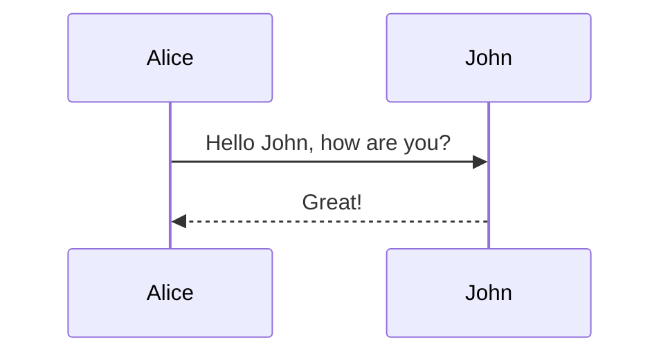

# hello-dx sample



## How to build

```
$ docker build -t hello-dx . --build-arg MAVEN_OPTS="-Dhttps.proxyHost=proxy.server Dhttps.proxyPort=port"
```

## How to run

```
$ docker run --rm --name hello-dx -p 8080:8080 hello-dx
$ curl http://localhost:8080/
```

# Mongo

```
mongo -u root -p example
use test
db.createUser({user:"root",pwd:"example",roles:[{role:"readWrite",db:"test"}]})
db.books.insert({"title":"title1","author":"author1"})
db.books.insert({"title":"title2","author":"author2"})
```

# testing

- [Testing](https://docs.spring.io/spring-framework/docs/5.2.12.RELEASE/spring-framework-reference/testing.html#testing)
- [Spring Boot Features - 26.Testing](https://docs.spring.io/spring-boot/docs/2.3.8.RELEASE/reference/html/spring-boot-features.html#boot-features-testing)

## MongoDB

- [Spring Boot Integration Testing with Embedded MongoDB | Baeldung](https://www.baeldung.com/spring-boot-embedded-mongodb)
- 