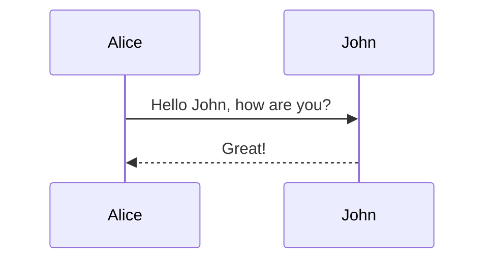

# hello-dx sample



## How to build

```
$ docker build -t hello-dx . --build-arg MAVEN_OPTS="-Dhttps.proxyHost=proxy.server Dhttps.proxyPort=port"
```

## How to run

```
$ docker run --rm --name hello-dx -p 8080:8080 hello-dx
$ curl http://localhost:8080/
```

